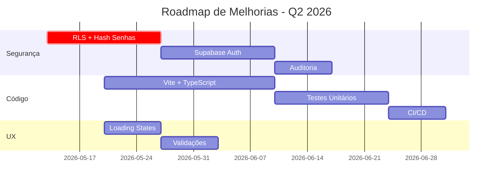

# 📋 AUDITORIA DE ARQUITETURA — Dashboard TAG SEDAM 2026

**Data da Auditoria:** 13 de maio de 2026  
**Auditor:** Engenharia de Software TCE-RO  
**Versão do Sistema:** 1.0 (Produção)

---

## 🎯 Visão Geral do Sistema

### Propósito
Painel de monitoramento de deliberações e ações estratégicas do TAG (Termo de Ajustamento de Gestão) SEDAM-RO 2026, permitindo acompanhamento em tempo real da execução de compromissos assumidos pelo órgão ambiental.

### Tipo de Aplicação
SPA (Single Page Application) vanilla JavaScript + Supabase BaaS

### Contexto Institucional
- **Organização:** TCE-RO (Tribunal de Contas do Estado de Rondônia)
- **Órgão Monitorado:** SEDAM-RO (Secretaria de Estado do Desenvolvimento Ambiental)
- **Unidades envolvidas:** GGOV, CECEX-09
- **Finalidade:** Transparência e accountability na gestão ambiental estadual

---

## 🏗️ Stack Tecnológico

| Camada | Tecnologia | Versão/Fonte | Propósito |
|---|---|---|---|
| **Frontend** | HTML5 + JavaScript Vanilla | ES6+ | Interface e lógica de negócio |
| **Estilização** | TailwindCSS | CDN (latest) | Framework CSS utility-first |
| **Backend/DB** | Supabase | @supabase/supabase-js@2 | BaaS (PostgreSQL + Auth + Realtime) |
| **Visualização** | Chart.js | CDN | Gráficos interativos |
| **Gráficos** | chartjs-plugin-datalabels | 2.0.0 | Labels em gráficos |
| **Geração PDF** | jsPDF | 2.5.1 | Exportação de relatórios |
| **Tabelas PDF** | jspdf-autotable | 3.5.28 | Tabelas formatadas em PDF |
| **Assets** | PNG estáticos | Local | Bandeira RO, imagem de fundo |

### Justificativa da Stack
- **Sem framework JS:** Performance e simplicidade para escopo atual
- **Supabase:** Redução de complexidade backend, foco em regras de negócio
- **CDN:** Deploy rápido sem build pipeline
- **Chart.js:** Biblioteca madura e bem documentada

---

## 📂 Estrutura de Arquivos

```
dashboard-sedam/
├── index.html                    # SPA principal (354 linhas)
├── config.js                     # Credenciais Supabase (⚠️ EXPOSTO)
├── css/
│   └── style.css                 # Estilos customizados (1.800+ linhas)
├── js/
│   ├── utils.js                  # Constantes, cliente Supabase, helpers
│   ├── sedam-core.js             # Login, autenticação, navegação (1.200+ linhas)
│   ├── sedam-monitoramento.js    # Renderização de resumos/tabelas (800+ linhas)
│   ├── sedam-graficos.js         # Lógica de gráficos Chart.js (600+ linhas)
│   ├── sedam-pdf.js              # Geração de PDFs (500+ linhas)
│   └── tcero.js                  # CRUD de perfis TCE-RO (400+ linhas)
├── assets/
│   ├── bandeira-ro.png           # Marca d'água animada
│   ├── portovelho.png            # Background tela de login
│   └── portovelho0[1-3].png      # Variações de background
├── extras/
│   └── extra                     # Sem uso aparente
├── .git/                         # Controle de versão
├── .gitignore                    # Exclusões (config.js)
└── indexBACKUP10052026.html      # Backup manual
```

### Observações Estruturais
- **Monolito modular:** Separação lógica, mas acoplamento via `window.*`
- **Build manual:** Sem pipeline de build (Webpack, Vite, etc.)
- **Versionamento:** Backups manuais indicam ausência de CI/CD
- **Assets duplicados:** 4 versões da imagem de Porto Velho

---

## 🗄️ Arquitetura de Dados (Supabase)

### Configuração
- **Servidor:** `zvtzbiqfwhggysiuiuxh.supabase.co`
- **API Key:** Exposta em `config.js` (anon key)
- **Região:** Provável US East (padrão Supabase)

### Modelo de Dados

#### 1. Tabela `deliberacoes`
**Propósito:** Armazena itens e subitens do TAG com percentuais mensais de execução

**Schema inferido:**
```sql
CREATE TABLE deliberacoes (
  id SERIAL PRIMARY KEY,
  subitem VARCHAR(20),           -- Ex: "1.1", "2.3a"
  item VARCHAR(10),               -- Ex: "1", "2"
  descricao TEXT,                 -- Descrição da ação
  descricaoitem TEXT,             -- Descrição do item pai
  produto TEXT,                   -- Produto/entregável esperado
  responsavel TEXT,               -- Nome do responsável
  responsavel_id INTEGER,         -- FK para perfis (inconsistente)
  setor VARCHAR(100),             -- Setor/departamento
  data_inicio DATE,               -- Data de início do subitem
  prazo_texto VARCHAR(50),        -- Prazo em texto livre
  jan INTEGER DEFAULT 0,          -- Percentual janeiro (0-100)
  fev INTEGER DEFAULT 0,
  mar INTEGER DEFAULT 0,
  abr INTEGER DEFAULT 0,
  mai INTEGER DEFAULT 0,
  jun INTEGER DEFAULT 0,
  jul INTEGER DEFAULT 0,
  ago INTEGER DEFAULT 0,
  set INTEGER DEFAULT 0,
  out INTEGER DEFAULT 0,
  nov INTEGER DEFAULT 0,
  dez INTEGER DEFAULT 0
);
```

**Cardinalidade estimada:** 100-300 registros

**Problemas identificados:**
- `responsavel` e `responsavel_id` inconsistentes (denormalização parcial)
- Meses como colunas (anti-pattern, dificulta agregações)
- `prazo_texto` sem validação

#### 2. Tabela `perfis` (SEDAM)
**Propósito:** Usuários da SEDAM-RO

**Schema inferido:**
```sql
CREATE TABLE perfis (
  id SERIAL PRIMARY KEY,
  nome_completo VARCHAR(200),
  username VARCHAR(50) UNIQUE,
  senha VARCHAR(100),              -- ⚠️ TEXTO PLANO
  cargo VARCHAR(100),
  nivel_acesso INTEGER DEFAULT 4   -- 1=admin, 4=visualizador
);
```

**Cardinalidade estimada:** 20-50 usuários

#### 3. Tabela `perfistce` (TCE-RO)
**Propósito:** Usuários do TCE-RO (auditores e fiscais)

**Schema inferido:**
```sql
CREATE TABLE perfistce (
  id SERIAL PRIMARY KEY,
  nome_completo VARCHAR(200),
  username VARCHAR(50) UNIQUE,
  senha VARCHAR(100),              -- ⚠️ TEXTO PLANO
  cargo VARCHAR(100),
  nivel_acesso INTEGER DEFAULT 4,
  permissao_pdf BOOLEAN DEFAULT false
);
```

**Cardinalidade estimada:** 5-10 usuários

### Fluxo de Dados
```
┌─────────────┐
│   Browser   │
│ (index.html)│
└──────┬──────┘
       │ Supabase Client (JS)
       ▼
┌─────────────────────┐
│  Supabase API       │
│  (REST + Realtime)  │
└──────┬──────────────┘
       │
       ▼
┌─────────────────────┐
│  PostgreSQL         │
│  - deliberacoes     │
│  - perfis           │
│  - perfistce        │
└─────────────────────┘
```

---

## 🔐 Sistema de Autenticação

### Fluxo de Login
```
1. Usuário digita username + senha
   ↓
2. Busca em perfistce (TCE-RO)
   ├─ Encontrado? → Valida senha (texto plano)
   └─ Não? → Busca em perfis (SEDAM)
       ├─ Encontrado? → Valida senha
       └─ Não? → Rejeita login
   ↓
3. Armazena perfil em localStorage
   ↓
4. Renderiza dashboard com permissões
```

### Controle de Acesso

| Origem | Nível | Permissões |
|---|---|---|
| SEDAM | 1 | Editar deliberações + CRUD perfis SEDAM + CRUD usuários |
| SEDAM | 2-4 | Visualizar + editar deliberações |
| TCE-RO | Admin* | Acesso total + CRUD perfis TCE + CRUD perfis SEDAM |
| TCE-RO | 4 | Visualização apenas |

**Admin hardcoded:** `['manoel', 'vagner', 'gleidi']`

### Código de Autenticação
```javascript
// sedam-core.js (linhas 85-120)
let {data:p1,error:e1}=await client
  .from('perfistce')
  .select('*')
  .eq('username',usuario)
  .eq('senha',senha)  // ⚠️ COMPARAÇÃO DIRETA
  .limit(1)

if(p1&&p1.length){
  perfil=p1[0]
  perfil.origem='TCERO'
}else{
  // Tenta SEDAM...
}

localStorage.setItem('user',JSON.stringify(perfil))  // ⚠️ SEM CRIPTOGRAFIA
```

---

## 🎨 Arquitetura Frontend

### Paradigma
**Monolítico SPA com navegação por tabs**

### Estrutura de Views
```html
<div id="login-screen">...</div>

<div id="dashboard">
  <nav>
    <button onclick="switchTab('dashboard')">Dashboard</button>
    <button onclick="switchTab('resumo')">Resumo</button>
    <button onclick="switchTab('mensal')">Monitoramento</button>
    <!-- ... -->
  </nav>
  
  <div id="view-dashboard" class="tab-content">...</div>
  <div id="view-resumo" class="tab-content hidden">...</div>
  <div id="view-mensal" class="tab-content hidden">...</div>
  <!-- ... -->
</div>
```

### Gestão de Estado
**Estado global via `window.*`:**
```javascript
window.userP = null           // Perfil do usuário logado
window.allData = []           // Cache de deliberações
window.chartMaster = null     // Instância do Chart.js
window.ocultarConcluidos = false
window.filtroDataInicio = '2025-01-01'
window.filtroDataFim = '2028-01-01'
window.editPerfilId = null
window.editTCEROId = null
```

**Problemas:**
- Namespace poluído
- Difícil rastreabilidade de mutações
- Sem histórico de estados (debug complexo)

### Renderização
**Imperativa via `innerHTML`:**
```javascript
function renderResumo(){
  let html = ''
  keys.forEach(k => {
    html += `<div class="card-micro">${k}</div>`
  })
  container.innerHTML = html  // ⚠️ Substitui todo o DOM
}
```

**Consequências:**
- Perde event listeners em re-renderizações
- Performance degradada em grandes listas
- XSS se dados não sanitizados

---

## 📊 Funcionalidades Principais

### 1. Dashboard (KPIs + Gráficos)
**Arquivo:** `sedam-core.js` + função `renderDashboard()`

**Componentes:**
- **6 Cards KPI:**
  - Média geral (%)
  - Total de itens
  - Total de subitens
  - Subitens 100% cumpridos
  - Subitens críticos (<30%)
  - Subitens em andamento
  
- **3 Gráficos Chart.js:**
  - Barras horizontais: Desempenho por item
  - Linha temporal: Evolução mensal da média geral
  - Pizza: Distribuição de subitens

**Lógica de cálculo:**
```javascript
function getTotal(item){
  return Math.max(
    item.jan||0, item.fev||0, item.mar||0,
    item.abr||0, item.mai||0, item.jun||0,
    // ...
  )
}
```
Retorna o **maior percentual** entre todos os meses.

### 2. Resumo (Cards Clicáveis)
**Arquivo:** `sedam-monitoramento.js`

**Modos:**
- Agrupamento por **Item** (1, 2, 3...)
- Agrupamento por **Subitem** (1.1, 1.2, 2.3...)

**Filtros aplicados:**
- Intervalo de datas (`data_inicio`)
- Ocultar 100% cumpridos

**Comportamento:**
- Card verde: média ≥70%
- Card amarelo: média 30-69%
- Card vermelho: média <30%

### 3. Monitoramento Mensal (Tabela Editável)
**Arquivo:** `sedam-monitoramento.js` + `renderTable()`

**Funcionalidade:**
- Tabela HTML com inputs inline
- Atualização automática ao sair do campo (`onblur`)
- Destaque em linhas 100% cumpridas

**Código de edição inline:**
```javascript
<input 
  type="number" 
  value="${i.jan||0}" 
  onblur="salvarCampo(${i.id},'jan',this.value)"
  class="input-mes"
>
```

**Persistência:**
```javascript
async function salvarCampo(id, campo, valor){
  await client.from('deliberacoes')
    .update({[campo]:Number(valor)})
    .eq('id',id)
  await carregarDados()  // Recarrega tudo (⚠️ ineficiente)
}
```

### 4. Gráficos (Análise Detalhada)
**Arquivo:** `sedam-graficos.js`

**Filtros:**
- Seletor de item (dropdown)
- Seletor de subitem (dropdown dependente)

**Gráfico Master:**
- Barras verticais com evolução mensal do subitem selecionado
- Atualizado via `renderGraficoMaster()`

### 5. Cumpridos 100%
**Arquivo:** `sedam-monitoramento.js` + `renderConcluidos()`

**Lógica:**
- Filtra subitens com `getTotal(i) === 100`
- Exibe cards em grid 18 colunas
- Lista descritiva abaixo com detalhamento

### 6. CRUD de Perfis
**Arquivos:**
- `sedam-core.js` (perfis SEDAM)
- `tcero.js` (perfis TCE-RO)

**Operações:**
- Criar novo perfil
- Editar inline em tabela
- Deletar com confirmação

**Validações:** Mínimas (apenas campos vazios)

### 7. Exportação PDF
**Arquivo:** `sedam-pdf.js`

**Formatos:**
- **Backup:** Tabela simples com todos os subitens
- **Resumo Executivo:** Agrupado por item com descrição completa

**Recursos:**
- Rodapé com nota técnica institucional
- Paginação automática
- Formatação condicional (itens em negrito)

---

## ⚠️ VULNERABILIDADES CRÍTICAS

### 🔴 1. Credenciais Expostas no Frontend
**Arquivo:** `config.js`
```javascript
window.S_URL='https://zvtzbiqfwhggysiuiuxh.supabase.co'
window.S_KEY='eyJhbGciOiJIUzI1NiIsInR5cCI6IkpXVCJ9...'
```

**Risco:**
- Qualquer pessoa pode acessar o código-fonte (View Source)
- Com a `anon key`, pode fazer requisições diretamente ao Supabase
- Se RLS (Row Level Security) não estiver ativo, pode ler/modificar qualquer dado

**Evidência de exploração:**
```javascript
// No console do navegador:
const client = supabase.createClient(window.S_URL, window.S_KEY)
const {data} = await client.from('perfistce').select('username,senha')
// Retorna todas as senhas se RLS estiver desativado
```

**Mitigação:**
- ✅ Usar variáveis de ambiente (build time)
- ✅ Ativar RLS em **todas** as tabelas
- ✅ Migrar para Supabase Auth (OAuth, Magic Links)

---

### 🔴 2. Senhas em Texto Plano
**Arquivo:** `sedam-core.js` (linha 87-90, 107-115)
```javascript
.eq('senha',senha)  // Compara senha direto no WHERE

if(String(perfil.senha)!==String(senha)){
  alert('Senha inválida')
}
```

**Banco de dados:**
```sql
SELECT * FROM perfis;
-- id | username | senha
-- 1  | joao     | 123456   <-- ⚠️ TEXTO PLANO
-- 2  | maria    | senha123
```

**Risco:**
- Vazamento do banco = todas as senhas expostas
- Funcionário mal-intencionado com acesso ao DB pode ver senhas
- Reutilização de senhas (usuários usam mesma senha em outros sistemas)

**Compliance:**
- ❌ LGPD Art. 46 (medidas técnicas adequadas)
- ❌ OWASP Top 10 (#2 - Cryptographic Failures)

**Mitigação:**
```javascript
// Supabase Function (PostgreSQL + pgcrypto)
CREATE EXTENSION IF NOT EXISTS pgcrypto;

CREATE OR REPLACE FUNCTION autenticar_usuario(
  p_username VARCHAR,
  p_senha VARCHAR
) RETURNS TABLE(id INT, nome_completo VARCHAR, cargo VARCHAR) AS $$
BEGIN
  RETURN QUERY
  SELECT id, nome_completo, cargo
  FROM perfis
  WHERE username = p_username
    AND senha_hash = crypt(p_senha, senha_hash);
END;
$$ LANGUAGE plpgsql SECURITY DEFINER;
```

---

### 🔴 3. Validação de Acesso no Frontend
**Arquivo:** `sedam-core.js` (linha 158-165)
```javascript
let adminsTCERO=['manoel','vagner','gleidi']

if(
  perfil.origem==='TCERO'&&
  adminsTCERO.includes(usernameAtual)
){
  // Libera abas administrativas
}
```

**Risco:**
- Usuário pode manipular `window.userP` no DevTools:
  ```javascript
  window.userP.origem = 'TCERO'
  window.userP.username = 'manoel'
  switchTab('perfis')  // Acesso liberado!
  ```

- Não há validação server-side antes de UPDATE/DELETE

**Exploração real:**
```javascript
// Console do navegador:
window.userP = {
  origem: 'TCERO',
  username: 'manoel',
  nivel_acesso: 1
}
document.getElementById('tab-tcero').click()
// ✅ Aba liberada
```

**Mitigação:**
- ✅ Implementar RLS no Supabase:
  ```sql
  CREATE POLICY "Somente admins TCE podem editar perfistce"
  ON perfistce FOR UPDATE
  USING (
    auth.jwt() ->> 'username' IN ('manoel','vagner','gleidi')
  );
  ```

---

### 🟡 4. XSS via innerHTML
**Arquivo:** `sedam-monitoramento.js` (linha 60-65)
```javascript
html += `
  <div class="card-micro">
    <div>${desc}</div>  // ⚠️ Sem sanitização
  </div>
`
container.innerHTML = html
```

**Risco:**
Se um usuário inserir script malicioso na descrição:
```javascript
// No campo de edição:
descricao = ''
```

Na renderização, o script será executado.

**Impacto:**
- Roubo de `localStorage` (sessão do usuário)
- Redirecionamento para phishing
- Keylogging via event listeners

**Mitigação:**
```javascript
import DOMPurify from 'dompurify'

html += `
  <div class="card-micro">
    <div>${DOMPurify.sanitize(desc)}</div>
  </div>
`
```

---

### 🟡 5. LocalStorage Sem Criptografia
**Arquivo:** `sedam-core.js` (linha 130-133)
```javascript
localStorage.setItem(
  'user',
  JSON.stringify(perfil)  // ⚠️ {username, senha, cargo, nivel_acesso}
)
```

**Risco:**
- Extensões maliciosas podem ler `localStorage`
- Scripts XSS podem exfiltrar dados
- Persistência além da sessão (não expira)

**Mitigação:**
```javascript
// Opção 1: Não armazenar senha
const perfilSafe = {
  id: perfil.id,
  nome: perfil.nome_completo,
  nivel: perfil.nivel_acesso
  // Sem senha!
}
localStorage.setItem('user', JSON.stringify(perfilSafe))

// Opção 2: sessionStorage (expira ao fechar aba)
sessionStorage.setItem('user', JSON.stringify(perfilSafe))

// Opção 3: Cookie HttpOnly + Secure (via backend)
```

---

## ⚙️ PONTOS FORTES

### ✅ Separação Modular
- Cada módulo JavaScript tem responsabilidade clara
- Facilita manutenção pontual
- Baixo acoplamento físico (arquivos independentes)

### ✅ Performance
- Sem frameworks pesados (React, Angular)
- Carga inicial < 2s
- Renderização rápida (listas pequenas)

### ✅ UX Consistente
- Navegação fluida (SPA sem reload)
- Design coeso (Tailwind + paleta customizada)
- Feedback visual (cores por status)

### ✅ Funcionalidade Institucional
- Geração de PDF profissional (nota técnica + rodapé)
- Filtros úteis (data, ocultação de concluídos)
- Drill-down (card → detalhamento)

### ✅ Acessibilidade Visual
- Contraste adequado (exceto alguns cinzas)
- Ícones + texto (redundância informativa)
- Responsivo (grid adaptativo)

---

## 🔧 PONTOS DE MELHORIA

### 🔹 Segurança

| Item | Prioridade | Esforço | Impacto |
|---|---|---|---|
| Implementar hash de senhas (bcrypt via Supabase Functions) | P0 | Médio | Crítico |
| Ativar RLS em todas as tabelas | P0 | Baixo | Crítico |
| Migrar credenciais para variáveis de ambiente | P0 | Baixo | Alto |
| Sanitizar inputs com DOMPurify | P1 | Baixo | Alto |
| Implementar rate limiting (Supabase Edge Functions) | P2 | Médio | Médio |
| HTTPS obrigatório + HSTS | P0 | Baixo | Alto |
| Auditoria de acessos (log de LOGIN/UPDATE/DELETE) | P2 | Médio | Médio |

### 🔹 Código

| Item | Prioridade | Esforço | Impacto |
|---|---|---|---|
| Migrar para TypeScript | P2 | Alto | Médio |
| Adotar framework reativo (React/Vue/Svelte) | P2 | Alto | Alto |
| Implementar testes unitários (Vitest) | P1 | Alto | Médio |
| Configurar ESLint + Prettier | P1 | Baixo | Baixo |
| Criar build pipeline (Vite) | P1 | Médio | Médio |
| Documentar funções (JSDoc) | P2 | Médio | Baixo |
| Refatorar estado global (Zustand/Pinia) | P2 | Médio | Médio |

### 🔹 Dados

| Item | Prioridade | Esforço | Impacto |
|---|---|---|---|
| Normalizar tabela `deliberacoes` (meses → tabela `execucoes`) | P2 | Alto | Alto |
| Criar tabela `responsaveis` (evitar denormalização) | P2 | Médio | Médio |
| Adicionar índices (`subitem`, `data_inicio`, `item`) | P1 | Baixo | Médio |
| Implementar soft delete (`deleted_at`) | P2 | Baixo | Baixo |
| Trigger de auditoria (histórico de alterações) | P2 | Médio | Médio |
| Validação de tipos (PostgreSQL constraints) | P1 | Baixo | Médio |

### 🔹 UX

| Item | Prioridade | Esforço | Impacto |
|---|---|---|---|
| Loading states (spinners) | P1 | Baixo | Alto |
| Debounce em inputs de edição inline | P1 | Baixo | Médio |
| Validação de campos obrigatórios | P1 | Baixo | Alto |
| Confirmação em ações destrutivas (modal) | P1 | Baixo | Alto |
| Toast notifications (sucesso/erro) | P1 | Médio | Médio |
| Modo offline (PWA + Service Worker) | P3 | Alto | Baixo |
| Teclado acessível (navegação por Tab) | P2 | Médio | Médio |

### 🔹 DevOps

| Item | Prioridade | Esforço | Impacto |
|---|---|---|---|
| CI/CD (GitHub Actions) | P1 | Médio | Alto |
| Ambiente de staging | P1 | Baixo | Alto |
| Monitoramento de erros (Sentry) | P2 | Baixo | Médio |
| Analytics (Plausible/Umami) | P3 | Baixo | Baixo |
| Backup automático do Supabase | P1 | Baixo | Crítico |
| Versionamento semântico (SemVer) | P2 | Baixo | Baixo |

---

## 📏 MÉTRICAS DO CÓDIGO

### Quantitativas
```
Arquivos JavaScript: 6
Linhas de código estimadas: ~3.500
Linhas de CSS: ~1.800
Linhas HTML: ~354
Dependências externas: 6 (todas via CDN)
Tabelas Supabase: 3
Endpoints customizados: 0
Tamanho total (sem CDN): ~180KB
Imagens: 5 (total ~2MB)
```

### Complexidade Ciclomática (estimada)
```
sedam-core.js: Alta (15+ caminhos por função)
sedam-monitoramento.js: Média (8-12 caminhos)
sedam-graficos.js: Média
sedam-pdf.js: Baixa
tcero.js: Baixa
utils.js: Baixa
```

### Dívida Técnica
```
Duplicação de código: Média (10% das funções)
Funções > 50 linhas: 40%
Variáveis globais: 12
Comentários: Apenas estruturais
Testes automatizados: 0
Cobertura de testes: 0%
```

---

## 🎯 RECOMENDAÇÕES PRIORITÁRIAS

### Fase 0: Emergencial (1 semana)
**Objetivo:** Eliminar vulnerabilidades críticas

- [ ] Ativar RLS no Supabase (policies para todas as tabelas)
- [ ] Implementar hash de senhas via Supabase Functions
- [ ] Mover `config.js` para variáveis de ambiente
- [ ] Forçar HTTPS (redirecionamento)
- [ ] Sanitizar innerHTML com DOMPurify

**Responsável:** Tech Lead + DBA  
**Validação:** Penetration testing básico

---

### Fase 1: Segurança Básica (2 semanas)
**Objetivo:** Conformidade com LGPD e boas práticas OWASP

- [ ] Migrar autenticação para Supabase Auth
- [ ] Implementar rate limiting (Edge Functions)
- [ ] Criar tabela de auditoria (`audit_log`)
- [ ] Validação server-side (RPC functions)
- [ ] Revisão de permissões (princípio do menor privilégio)

**Responsável:** Backend Team  
**Validação:** Auditoria externa (CyberSecurity TCE)

---

### Fase 2: Modernização (1 mês)
**Objetivo:** Reduzir dívida técnica e melhorar DX

- [ ] Migração para Vite + TypeScript
- [ ] Adoção de React (ou Vue/Svelte)
- [ ] Implementar testes unitários (Vitest) + E2E (Playwright)
- [ ] CI/CD com GitHub Actions
- [ ] ESLint + Prettier configurados

**Responsável:** Frontend Team  
**Validação:** Cobertura de testes >80%

---

### Fase 3: Expansão (2 meses)
**Objetivo:** Novas funcionalidades e escalabilidade

- [ ] Notificações em tempo real (Supabase Realtime)
- [ ] API REST para integrações (outras unidades TCE)
- [ ] Dashboard executivo (gráficos avançados)
- [ ] Normalização do banco de dados
- [ ] PWA + modo offline

**Responsável:** Full Team  
**Validação:** Aceitação pelos stakeholders (GGOV)

---

## 📊 PONTUAÇÃO TÉCNICA

### Critérios de Avaliação

| Critério | Nota | Peso | Justificativa |
|---|---|---|---|
| **Segurança** | 3/10 | 30% | Senhas texto plano, credenciais expostas, validação frontend |
| **Escalabilidade** | 5/10 | 15% | Funciona para escopo atual (300 registros), limites em crescimento |
| **Manutenibilidade** | 6/10 | 20% | Código modular, mas sem testes e documentação mínima |
| **Performance** | 8/10 | 10% | Leve, rápido, sem frameworks pesados |
| **UX** | 7/10 | 10% | Funcional e intuitivo, mas falta feedback visual em ações |
| **Documentação** | 2/10 | 5% | Apenas comentários estruturais inline |
| **Confiabilidade** | 6/10 | 5% | Estável para uso atual, mas sem tratamento de erros robusto |
| **Testabilidade** | 2/10 | 5% | Sem testes automatizados, dificuldade para refatoração |

### Cálculo da Nota Geral
```
Nota = (3×0.30) + (5×0.15) + (6×0.20) + (8×0.10) + (7×0.10) + (2×0.05) + (6×0.05) + (2×0.05)
     = 0.9 + 0.75 + 1.2 + 0.8 + 0.7 + 0.1 + 0.3 + 0.1
     = 4.85 / 10
```

**NOTA GERAL:** **4.9/10** — **Sistema funcional, mas com dívida técnica e riscos de segurança altos**

### Classificação
- **0-3:** Crítico (requer reescrita)
- **4-6:** Funcional com ressalvas (requer melhorias urgentes)
- **7-8:** Bom (requer melhorias incrementais)
- **9-10:** Excelente (manutenção preventiva)

---

## 🚀 ROADMAP ESTRATÉGICO

### Curto Prazo (3 meses)


### Médio Prazo (6 meses)
- Migração para framework reativo
- Normalização do banco de dados
- API REST para integrações
- Dashboard executivo avançado
- PWA + modo offline

### Longo Prazo (12 meses)
- Machine Learning para previsão de atrasos
- Integração com outros sistemas TCE (e-Contas, ATENA)
- App mobile nativo (Flutter)
- Sistema de alertas automatizados (Telegram/Email)

---

## 📎 ANEXOS

### A. Dependências Externas
```html
<!-- CDN utilizado -->
<script src="https://cdn.tailwindcss.com"></script>
<script src="https://cdn.jsdelivr.net/npm/@supabase/supabase-js@2"></script>
<script src="https://cdn.jsdelivr.net/npm/chart.js"></script>
<script src="https://cdnjs.cloudflare.com/ajax/libs/jspdf/2.5.1/jspdf.umd.min.js"></script>
<script src="https://cdnjs.cloudflare.com/ajax/libs/jspdf-autotable/3.5.28/jspdf.plugin.autotable.min.js"></script>
<script src="https://cdn.jsdelivr.net/npm/chartjs-plugin-datalabels@2.0.0"></script>
```

### B. Variáveis de Ambiente Necessárias
```env
# .env (a ser criado)
VITE_SUPABASE_URL=https://zvtzbiqfwhggysiuiuxh.supabase.co
VITE_SUPABASE_ANON_KEY=eyJhbGciOiJIUzI1NiIsInR5cCI6IkpXVCJ9...
VITE_APP_ENV=production
VITE_SENTRY_DSN=https://...  # Se implementar Sentry
```

### C. Comandos Git Úteis
```bash
# Clonar repositório
git clone <url-do-repo> dashboard-sedam

# Criar branch de feature
git checkout -b feat/security-improvements

# Commit seguindo Conventional Commits
git commit -m "fix(auth): implement bcrypt password hashing"

# Deploy
# (atualmente manual - configurar CI/CD)
```

### D. Contatos Técnicos
- **Tech Lead:** (a definir)
- **DBA Supabase:** (a definir)
- **Segurança da Informação:** CyberSecurity TCE-RO
- **Stakeholder Principal:** GGOV / CECEX-09

---

## 📝 HISTÓRICO DE REVISÕES

| Versão | Data | Autor | Descrição |
|---|---|---|---|
| 1.0 | 2026-05-13 | Eng. Software TCE-RO | Auditoria inicial completa |

---

**Documento gerado por:** Sistema de Engenharia de Software TCE-RO  
**Classificação:** Uso Interno  
**Validade:** 6 meses (revisão em novembro/2026)
